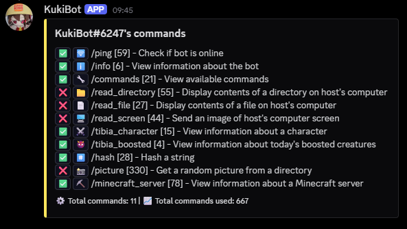
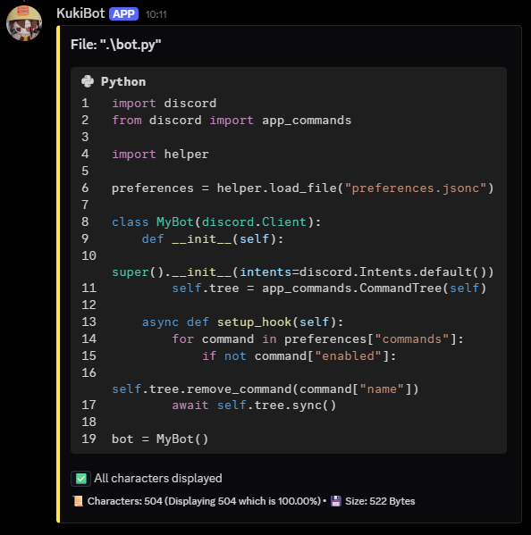
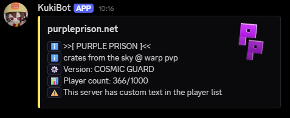

> [!IMPORTANT]
> This is not a finished project and it's being actively developed

# Kuki Bot (˶˃ ᵕ ˂˶)

Discord Bot with random features





## Commands

- 🛜 /ping - Check if bot is online

- ℹ️ /info - View information about the bot

- 🔧 /commands - View available commands

- 📁 /read_directory - Display contents of a directory on host's computer

- 📄 /read_file* - Display contents of a file on host's computer

- 🖥️ /read_screen* - Send an image of host's computer screen

- ⚔️ /tibia_character* - View information about a character

- 👹 /tibia_boosted* - View information about today's boosted creatures

- #️⃣ /hash - Hash a string

- 📸 /picture - Get a random picture from a directory

- ⛏️ /minecraft_server - View information about a Minecraft server

**commands without configuration*

## Setup

### Discord

1. Head to the [Discord developer portal](https://discord.com/developers/applications) and setup a create a new application

2. In the installation tab select allowed contexts and add `applications.commands` to scope and add the app

### Code

The commands are for powershell, use common sense if you're using something different

```ps
git clone https://github.com/vrceao/kuki-discord-bot
cd kuki-discord-bot
copy .env.example .env
copy preferences.example.jsonc preferences.jsonc
py -m pip install -r requirements.txt
```

- Put your discord bot token from the Discord developer portal in the `.env` file (Do not share it with anyone!)

You're done!

```ps
py .\main.py
```

## Customization

Parts of this bot are very heavily and easily customizable via `preferences.jsonc` which is full of comments

## License

This project is licensed under the [MIT License](LICENSE).